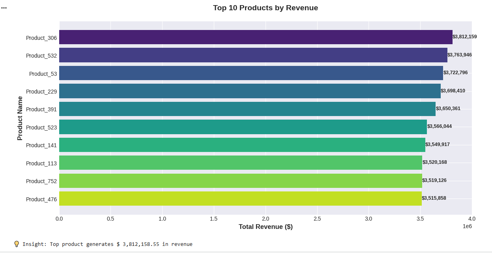
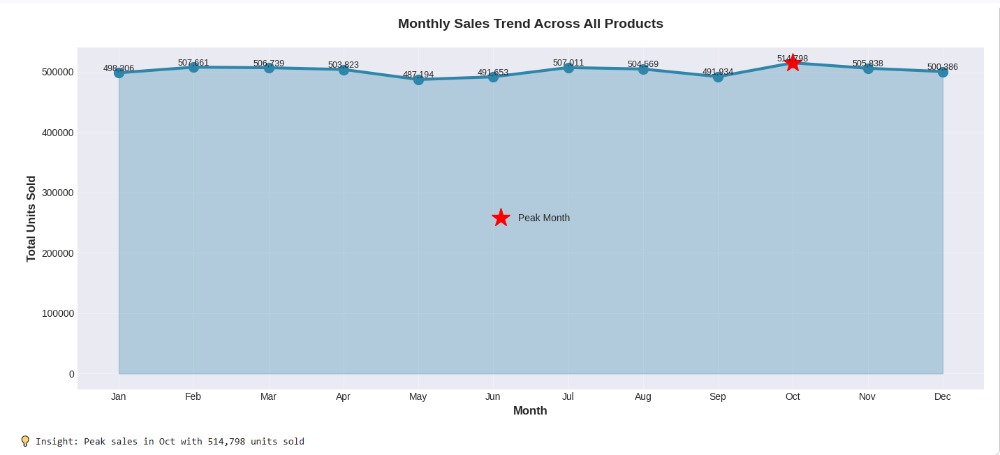
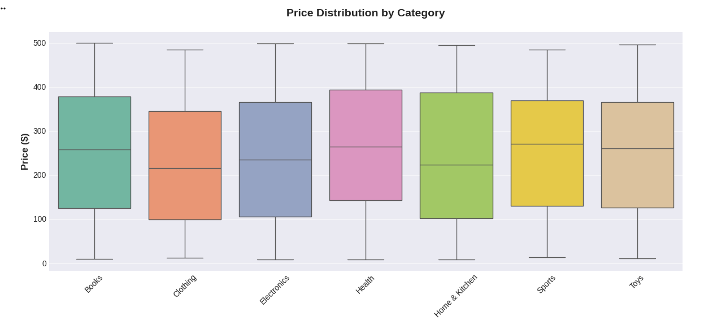
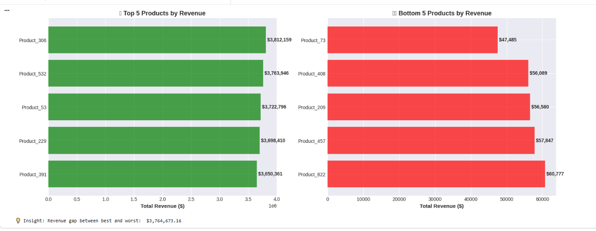

# 📊 Visualizations Gallery

This folder contains all charts and graphs generated during the E-commerce Sales Analysis project.

---

## 🎨 All Visualizations

### 1. Top 10 Products by Revenue
Identifies the highest-performing products driving business revenue.

---

### 2. Revenue by Product Category
Shows which categories contribute most to overall revenue.

---

### 3. Monthly Sales Trend
Reveals seasonal patterns across the entire year.

---

### 4. Category Sales Performance Over Time
Tracks how different categories perform month-by-month.

---

### 5. Price Distribution by Category
Compares pricing strategies across product categories.

---

### 6. Review Score vs Average Sales
Demonstrates the correlation between customer ratings and sales performance.

---

### 7. Review Score Distribution by Category
Shows how customer satisfaction varies by product category.

---

### 8. Product Performance Matrix
BCG-style matrix identifying Stars, Cash Cows, Question Marks, and Dogs.

---

### 9. Seasonal Patterns Heatmap
Visualizes sales intensity across categories and months.

---

### 10. Top 5 vs Bottom 5 Products
Direct comparison of best and worst performers.

---

### 11. Correlation Matrix
Shows relationships between key business metrics.

